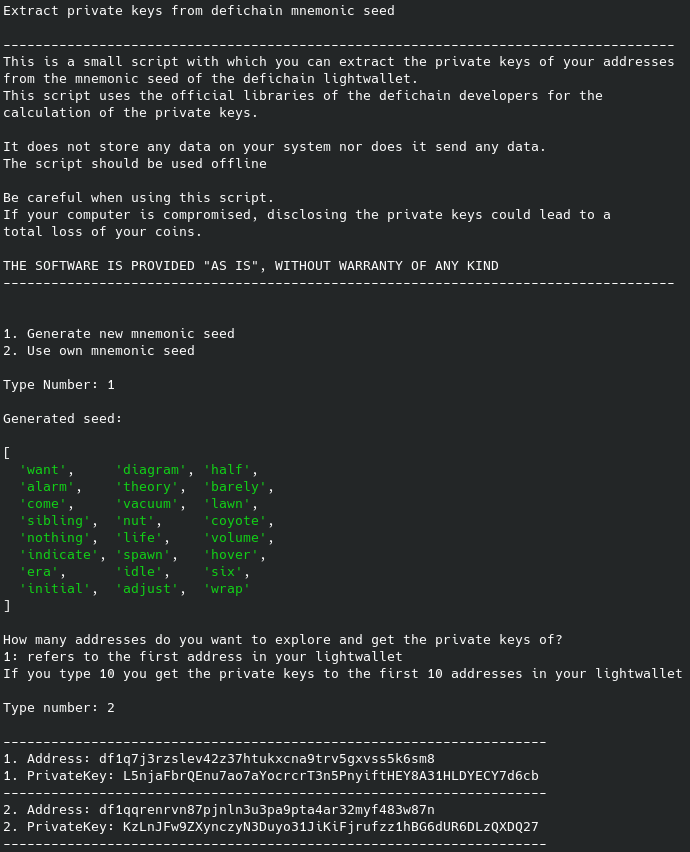

# Defichain Extract Private Keys

## Introduction

This is a small script with which you can extract the private keys of your addresses
from the mnemonic seed of the defichain lightwallet.

It uses the official libraries of the defichain developers to calculate the private keys.

This script aims to give everyone the possibility to extract their private keys from lightwallet without having to deal with these complex typescript libraries.

## What you need

1. You should preferably install the latest version of [NodeJs](https://nodejs.org/en/download/)
   
2. Be able to clone a git repository


## How to use it

1. Install [NodeJs](https://nodejs.org/en/download/)
2. Clone this Git repository
    ```bash
    git clone https://github.com/eric-volz/DefichainExtractPrivateKeys.git
    ```
3. Open the cloned repository and install the required dependencies
    ```bash
    cd DefichainExtractPrivateKeys
    npm install # installs all required dependencies witch are listed in package.json
    ```
4. Run the script
    
    #### Easy way: Run the precompiled version of the script
    ```bash
    node index.js # runs the script
    ```

    #### More complex: Compile the Code yourself and run it: index.ts
    ```bash
    npx tsc # compiles typescript code to javascript code: index.ts to index.js
    node index.js # runs the script
    ```
5. Follow the steps in your console: You can see an example below

### Example



## What you can do with the keys

- import the private key into your defichain full node and control your lightwallet address via the full node

    ```bash
    defi-cli importprivkey L5njaFbrQ4nu7ao7a3ocrcrT3n5PnyiftHEY8A31HLDY3CY7d6cb # private key is not valid
    ```


## Disclaimer

Be careful when using this script. 
If your computer is compromised, disclosing the private keys could lead to a
total loss of your coins.

I am still a beginner when it comes to TypeScript and JavaScript.
If you want to improve or fix something, feel free to open a pull request or an issue.

THE SOFTWARE IS PROVIDED "AS IS", WITHOUT WARRANTY OF ANY KIND